[English](./README.md) · [Website](https://scopereflex.lei6393.com) · [GitHub](https://github.com/SuperMarioYL/scopereflex)

<picture>
  <source media="(max-width: 600px) and (prefers-color-scheme: dark)" srcset="./assets/presentation/hero-mobile-dark.svg">
  <source media="(max-width: 600px)" srcset="./assets/presentation/hero-mobile-light.svg">
  <source media="(prefers-color-scheme: dark)" srcset="./assets/presentation/hero-dark.svg">
  
</picture>

# scopereflex

**接受任务前先检查更小的计划。**

ScopeReflex 从 JSON 或 Markdown 计划生成缩减版本，并展示结构差异供检查。

## 为什么需要它

可选步骤与重复文件条目可能让提案更难评估。规则生成的替代方案让你在接受前检查哪些内容被删除或合并。

- **比较替代计划** — 同时保留原始和缩减 manifest。
- **检查删除内容** — 规则记录缩减理由。
- **选择后再写入** — gate 将检查与已接受计划输出分开。

## 架构

<picture>
  <source media="(max-width: 600px) and (prefers-color-scheme: dark)" srcset="./assets/presentation/architecture-mobile-dark.svg">
  <source media="(max-width: 600px)" srcset="./assets/presentation/architecture-mobile-light.svg">
  <source media="(prefers-color-scheme: dark)" srcset="./assets/presentation/architecture-dark.svg">
  
</picture>

解析器校验计划；有序规则去重文件，把 helper 描述合并到同目录 index，删除可选文件和步骤，再估计较短输出。contract 报告差异，gate 可在选择后写出缩减计划。

| 组件 | 职责 |
| --- | --- |
| `JSON / Markdown plan` | src/contract.ts |
| `Contraction rules` | src/rules.ts |
| `Structural diff` | src/manifest.ts |
| `Review gate` | src/gate.ts |

## 安装与快速上手

使用仓库清单指定的运行时版本构建，并在仓库根目录运行示例。

```bash
git clone https://github.com/SuperMarioYL/scopereflex.git
cd scopereflex
npm ci
npm run build
```

对完整随仓计划执行 contract --summary，不写入已接受计划。

```bash
node dist/src/index.js contract examples/plan.json --summary
```

## 实际运行示例

<picture>
  <source media="(max-width: 600px) and (prefers-color-scheme: dark)" srcset="./assets/presentation/process-mobile-dark.svg">
  <source media="(max-width: 600px)" srcset="./assets/presentation/process-mobile-light.svg">
  <source media="(prefers-color-scheme: dark)" srcset="./assets/presentation/process-dark.svg">
  
</picture>

The bundled plan contracts from 14 to 4 files; displayed token savings are estimated by the rule model.

```text
ScopeReflex: 14→4 files, 3200→850 tokens (saved 2350 tokens)
```

完整命令与输出保存在 [docs/demo-results.json](./docs/demo-results.json). 输入和复现代码均随仓提供。


保留已有录制供参考；上方文字示例给出当前可复现的操作。

## 用法

CLI 提供以下操作。示例之外的命令需要替换成你的文件路径或标识。

```bash
node dist/src/index.js contract examples/plan.json
node dist/src/index.js contract examples/plan.json --json
node dist/src/index.js gate examples/plan.json
```

## 配置

在输入中显式标记可选文件与步骤。output_length_tokens 可提供原始估计，省略时由工具估计。contract 只读；gate 接受后写出独立缩减计划，--accept 跳过交互检查。

## 集成与职责分工

<picture>
  <source media="(max-width: 600px) and (prefers-color-scheme: dark)" srcset="./assets/presentation/integrations-mobile-dark.svg">
  <source media="(max-width: 600px)" srcset="./assets/presentation/integrations-mobile-light.svg">
  <source media="(prefers-color-scheme: dark)" srcset="./assets/presentation/integrations-dark.svg">
  
</picture>

以下路径已有源码实现。按任务选择输入，并把生成的结果与项目一起保存。

| 路径 | 已实现职责 |
| --- | --- |
| Plan JSON | Files, optional flags and steps |
| Markdown dialect | Lightweight plan input |
| JSON / summary | Contraction difference |
| Accepted plan | Separate output artifact |

## 限制与后续方向

- 规则不检查实现，也不证明更小计划满足任务；接受前应检查删除内容。
- token 值基于文件/步骤数量和不同系数估计，不是实测输出节省。
- 示例只报告缩减，不接受计划或修改源码。

语义任务验证和更智能缩减需要当前结构规则之外的额外证据。

## 许可与贡献

许可见 [LICENSE](./LICENSE). 反馈问题时请提供最小输入、执行命令和实际输出。
