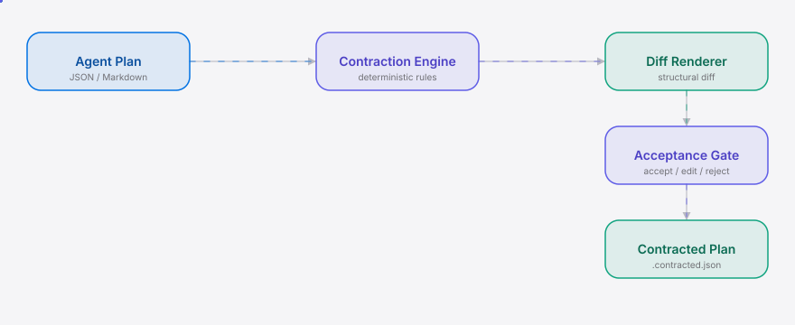

<div align="right"><sub><a href="./README.md">English</a>&nbsp;&nbsp;⇄&nbsp;&nbsp;<b>简体中文</b></sub></div>

<picture>
  <source media="(prefers-color-scheme: dark)" srcset="./assets/hero-dark.svg">
  <source media="(prefers-color-scheme: light)" srcset="./assets/hero-light.svg">
  
</picture>

<p align="center"><sub>面向过度生产的编码代理的反事实收缩反射。分叉出一份"做更少"的计划，并接受这份 diff。</sub></p>

<p align="center">
  <a href="./LICENSE"></a>
  
  
  
  
  
</p>

**当你的编码代理为一个 4 个文件就能完成的任务提出 14 个文件的计划时，ScopeReflex 会分叉出一份"做更少"的反事实方案，并在代理继续之前给出一份可计数的 diff 供你接受。**

前沿编码代理现在已能可靠地完成任务——于是约束瓶颈从"能不能完成"翻转为"做得太多"。r/ClaudeAI 上对 Opus-5 的抱怨（"我真的不再看 90% 的输出了"）正是这种模型层面的痛点。ScopeReflex 是 [headroomlabs-ai/headroom](https://github.com/headroomlabs-ai/headroom) 这类编码代理在计划审批环节所缺失的反射：它分叉出一份"做更少"的反事实方案和一份机器可校验的结构化 diff——这正是 [@DietrichGebert](https://github.com/DietrichGebert) 那个 10.5 万星的 [ponytail](https://github.com/DietrichGebert/ponytail) 证明了需求、却从未构建的更重一层的原语。Ponytail 停留在提示词层；ScopeReflex 加上了分叉 + diff + 接受闸门。

## 目录

- [架构](#架构)
- [为什么需要它](#为什么需要它)
- [安装与快速开始](#安装与快速开始)
- [用法](#用法)
- [演示](#演示)
- [对比 ponytail](#对比-ponytail)
- [路线图](#路线图)
- [许可证](#许可证)

<h2> 架构</h2>

<picture>
  <source media="(prefers-color-scheme: dark)" srcset="./assets/atlas-dark.svg">
  <source media="(prefers-color-scheme: light)" srcset="./assets/atlas-light.svg">
  
</picture>

单进程、单 CLI。没有守护进程、没有配置文件、没有 API key。你的代理计划以 JSON 或 markdown 输入；收缩引擎应用确定性规则并输出结构化的 `ContractionDiff`；闸门渲染它，你接受/编辑/拒绝，收缩后的计划即被写出供代理执行。

<h2> 为什么需要它</h2>

操作者常常批准一个 12 个文件的计划，而一个 3 个文件的变体本就能满足任务——却没有机器生成的更小方案摆在旁边供对比。ScopeReflex 把"范围对不对？"从仅靠人来判断，变成一个被浮现出来、可 diff 的选择。新原语是 **ContractionDiff**：代理所提计划与反事实收缩变体之间一份机器可校验的结构化范围 diff（文件前→后、步骤前→后、token 前→后）——而非事后的合理化解释。

<h2> 安装与快速开始</h2>

从冷克隆到第一个收缩 diff，三步：

```bash
git clone https://github.com/SuperMarioYL/scopereflex && cd scopereflex
npm install && npm run build
node dist/src/index.js contract examples/plan.json
```

<details>
<summary>示例输出</summary>

```
ScopeReflex Contraction-Diff
─────────────────────────────────────────────
Files:   14 → 4    -10
Steps:   12 → 5    -7
Output:  3,200 → 850 tokens  -2350
Blast:   severe → moderate

- src/api/v2/legacy.ts (optional, not on critical path)
- docs/login.md (optional, not on critical path)
↪ src/utils/helpers.ts (merged into sibling index)
• capped output to 850 tokens (terse-output rule)
```

</details>

发布到 npm 后，零安装路径为 `npx scopereflex contract plan.json`。

<h2> 用法</h2>

两个子命令——`contract`（输出 diff）与 `gate`（接受/拒绝/编辑）。计划是一个 JSON 文件（或 markdown，见 `examples/plan.md`）：

```json
{
  "intent": "Add a login endpoint with session handling",
  "files": [
    { "path": "src/auth/login.ts", "purpose": "login route handler", "optional": false },
    { "path": "src/api/v2/legacy.ts", "purpose": "legacy v2 shim", "optional": true }
  ],
  "steps": [
    { "id": "1", "description": "Implement login endpoint", "optional": false },
    { "id": "2", "description": "Add legacy v2 shim", "optional": true }
  ],
  "output_length_tokens": 3200
}
```

五个最常见的工作流：

```bash
# 1. 查看某份计划的收缩 diff
scopereflex contract examples/plan.json

# 2. 用于日志 / CI 的一行摘要
scopereflex contract examples/plan.json --summary

# 3. 机器可读的 diff（管道给某个 harness）
scopereflex contract examples/plan.json --json

# 4. 交互式闸门 —— 接受 / 编辑 / 拒绝，写出 plan.contracted.json
scopereflex gate examples/plan.json

# 5. 非交互式接受（CI / 演示）
scopereflex gate examples/plan.json --accept
```

收缩规则是确定性的，因此每一份 diff 都可审计：

1. **去重** —— 合并重复的文件路径。
2. **合并辅助文件** —— 把 `helpers.ts`/`utils.ts`/`common.ts` 折进同目录的 `index.ts`。
3. **丢弃可选文件** —— 任何标记 `optional: true` 的文件。
4. **丢弃可选步骤** —— 任何标记 `optional: true` 的步骤。
5. **封顶输出** —— 精简输出规则按存活项重新计算 token 估计。

<h2> 演示</h2>


一次完整的"计划 → diff → 接受后的收缩计划"运行。asciinema 源录制在 [`assets/demo.cast`](./assets/demo.cast)（可通过 [`docs/demo.tape`](./docs/demo.tape) 的 vhs 脚本重新录制）。需要时可手动触发 `demo` 工作流重新渲染 gif。

<h2> 对比 ponytail</h2>

最近的同需求邻接项目是 [DietrichGebert/ponytail](https://github.com/DietrichGebert/ponytail)（10.5 万星）——同一"做更少"论题的提示词版本。ScopeReflex 是更重一层的原语。

| 维度 | ScopeReflex | ponytail |
|---|---|---|
| 做更少论题 | ✓ 分叉反事实方案 | ✓ 提示词层 |
| 结构化收缩 diff | ✓ 机器可校验 | — 无 |
| 人工接受闸门 | ✓ 接受 / 编辑 / 拒绝 | — 无 |
| 安装摩擦 | 部分 —— 需要检查点钩子 | ✓ 拷贝一段提示词，零集成 |
| 采用度 | — 全新 | ✓ 10.5 万星 |

Ponytail 在安装摩擦与采用度上更胜一筹——这是诚实的对比。ScopeReflex 在"分叉 + diff + 闸门"三件套上占优，而这正是提示词技能在结构上无法承载的。

<h2> 路线图</h2>

- [x] **m1 —— 收缩引擎**：把计划解析为 `ScopeManifest`，应用收缩规则，向 stdout 输出 `ContractionDiff`。
- [x] **m2 —— 接受闸门**：交互式 TUI 渲染 diff，提示接受/编辑/拒绝，接受时写出 `plan.contracted.json`。
- [ ] **m3 —— 技能与演示**：Claude Code `SKILL.md` 封装（已交付），双语 README（已交付），真实 asciinema 录制（待人工录制）。
- [ ] **未来**：面向 Cursor / Codex CLI / Aider 的 harness 无关安装，针对爆炸半径缩减的评估套件，以及输出可粘贴 diff 的 `scopereflex share` 命令。

<h2> 许可证</h2>

MIT —— 见 [LICENSE](./LICENSE)。在 [issue 跟踪器](https://github.com/SuperMarioYL/scopereflex/issues) 上提交 issue 与 PR。

## 分享

```
ScopeReflex — the Coding Agent reflex: fork a do-less plan variant, surface a machine-checkable contraction-diff, gate it behind a human accept. Ship the 4-file variant your agent should've proposed, not the 14-file one it did. https://github.com/SuperMarioYL/scopereflex
```

推送后，设置仓库 topics，让对的受众找到它：

```bash
gh repo edit --add-topic coding-agent --add-topic agent --add-topic cli --add-topic developer-tools
```

<p align="center"><sub><a href="./LICENSE">MIT</a> © 2026 SuperMarioYL</sub></p>
